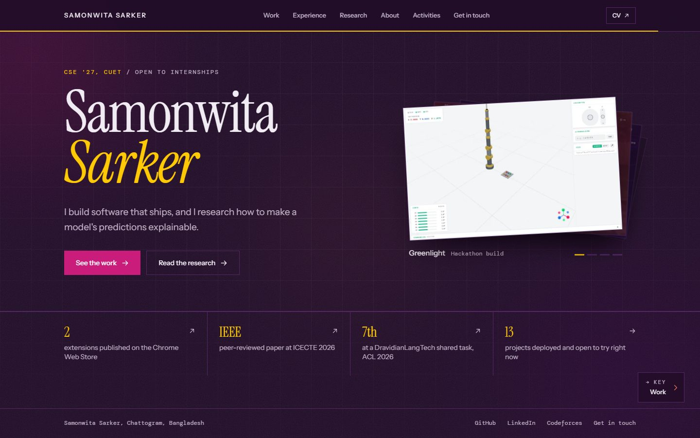
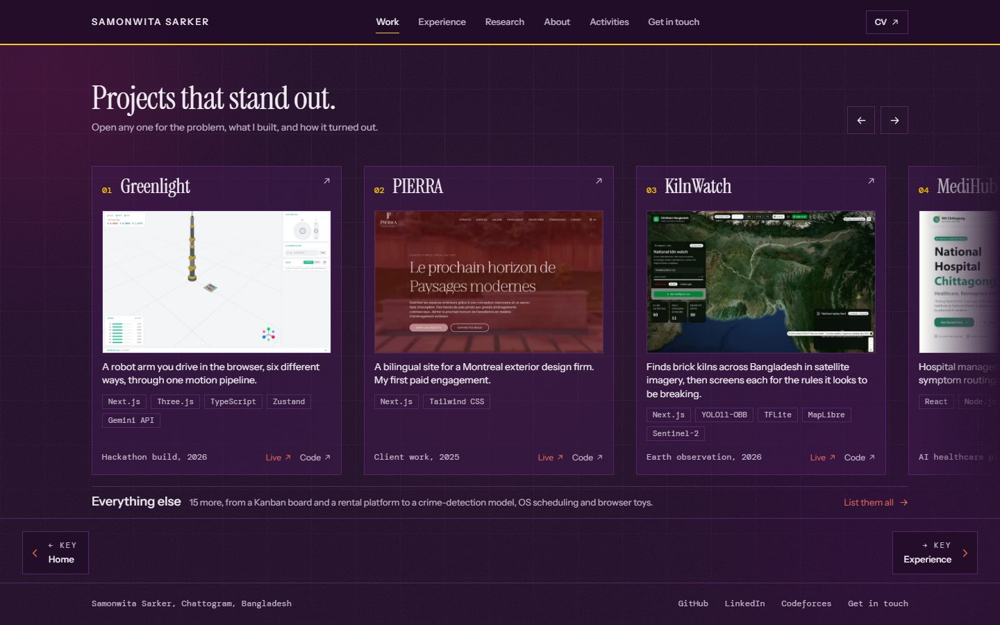
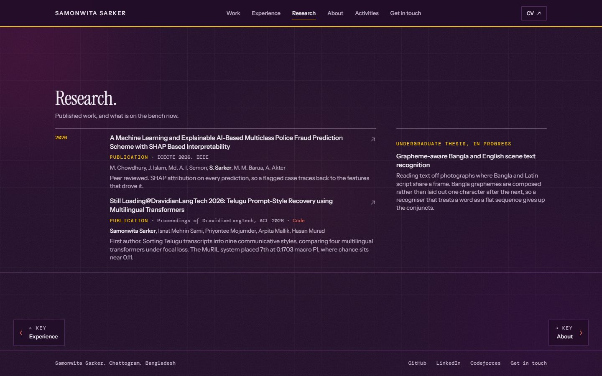
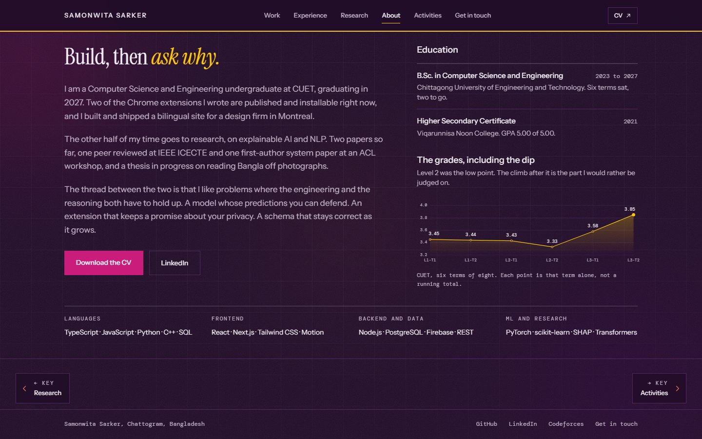
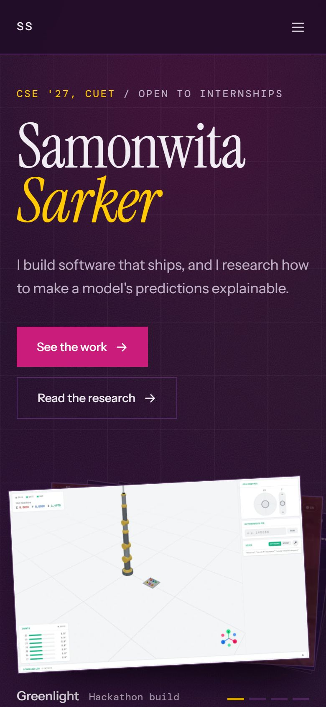

# Samonwita Sarker, portfolio

The personal site of Samonwita Sarker, a Computer Science and Engineering
undergraduate at CUET (class of 2027) who builds software and researches
explainable AI and NLP.

**Live:** [samonwita.vercel.app](https://samonwita.vercel.app)



<table>
  <tr>
    <td width="50%"></td>
    <td width="50%"></td>
  </tr>
  <tr>
    <td width="50%"></td>
    <td width="50%" align="center"></td>
  </tr>
</table>

---

## Contents

- [What the site is](#what-the-site-is)
- [Pages](#pages)
- [What it does well](#what-it-does-well)
- [Tech stack](#tech-stack)
- [Getting started](#getting-started)
- [Project structure](#project-structure)
- [Editing content](#editing-content)
- [Design system](#design-system)
- [How the build works](#how-the-build-works)
- [Things that are easy to break](#things-that-are-easy-to-break)
- [Deployment](#deployment)
- [Credits](#credits)

---

## What the site is

A portfolio built on one idea: **every claim carries its receipt.** Explainable
AI traces a prediction back to the features that caused it, and a debater backs
every point with evidence. The site does the same. Every project states the
problem, what was built and how it turned out, with a live link and the source
wherever they exist. Every figure in the strip under the hero links to the
thing that proves it: the Chrome Web Store listing, the IEEE paper, the ACL
Anthology page, the list of running projects.

Nothing is mocked up. Every project image is a capture of the real, running
product.

## Pages

| Route | What is on it |
|---|---|
| `/` | The name, one line on what she does, a shuffling stack of real screenshots, four proof figures, and three flagship projects |
| `/work` | Six projects in a grid and six more in a list, each opening a full case study |
| `/experience` | Team lead at BdREN Innovation (Cortex), Fleet AI, Inc., and a freelance client site |
| `/research` | An IEEE ICECTE 2026 paper, a first-author ACL 2026 system paper, and the thesis in progress |
| `/about` | Introduction, education with the CGPA and a term-by-term trend chart, and the stack |
| `/activities` | Leadership roles, competitions and certificates |
| `/contact` | Email, profiles and a contact form |
| `/repositories` | Every project in one table with source and live links, including work on other people's repositories |

The first seven are a reading sequence: the header nav, the left and right
arrow keys and the on-screen pager all walk them in that order.
`/repositories` is reached by link and sits outside the sequence.

## What it does well

- **Every page fits a laptop screen.** Each page in the reading sequence fits
  one screen from 1280x720 up. On short screens the spacing closes up, but text
  is never shrunk to fit. Phones scroll normally.
- **Arrow-key navigation** between sections, with a curtain transition that
  shows the name of the page you are moving to.
- **It works without JavaScript.** Every route is prerendered to real HTML, so
  search engines, link previews, applicant tracking systems and scrapers all
  read the full text, and a visitor with scripts off can still use every page.
- **Real metadata per page.** Each route ships its own title, description,
  canonical link and Open Graph tags, plus a generated sitemap and a social
  card rendered from the site's own fonts.
- **Genuine 404s,** with a designed page and a real 404 status.
- **Accessible by default.** One `h1` per page, labelled controls, a skip link,
  visible focus, 44px touch targets on touch screens, WCAG AA colour contrast,
  and every animation turned off under `prefers-reduced-motion`.
- **Light on the network.** Self-hosted fonts (88kB), responsive WebP
  screenshots at two sizes, long-lived caching for hashed assets, and skeleton
  placeholders shaped like the content they stand in for.
- **Honest about authorship.** Projects on repositories she does not own say so,
  with the owner's name and her role.

## Tech stack

| | |
|---|---|
| Framework | React 19, TypeScript 6, React Router 7 |
| Build | Vite 8, with a server-side render pass for prerendering |
| Styling | Tailwind CSS 3 plus hand-written CSS for the design tokens and short-screen rules |
| Motion | framer-motion |
| Icons | Phosphor |
| Fonts | Instrument Serif, Instrument Sans, DM Mono, self-hosted |
| Tooling | oxlint, Playwright (screenshot and image scripts only) |
| Hosting | Vercel |

The only other runtime dependency is Vercel Web Analytics. The contact form posts to
[FormSubmit](https://formsubmit.co), so there is no backend.

## Getting started

Requires Node.js 20.19 or later (or 22.12 or later), which Vite 8 needs.

```bash
npm install
npm run dev        # development server at http://localhost:5173
npm run build      # typecheck, build, server-render, and prerender every route into dist/
npm run preview    # serve the production build
npm run lint       # oxlint
```

Maintenance scripts, run by hand when their inputs change:

```bash
node scripts/capture-shots.mjs     # re-capture project screenshots from the live sites
node scripts/optimise-shots.mjs    # rebuild the 1400px and 700px WebP variants

# Both take ids, for when only one site has changed:
node scripts/capture-shots.mjs sixpence
node scripts/optimise-shots.mjs sixpence
node scripts/make-og.mjs           # re-render public/og.png, the social card
```

All three need a Playwright browser: `npx playwright install chromium`.

## Project structure

```
src/
  pages/            One component per route
  components/       Page sections and shared pieces:
                      Hero, ShotDeck, Proof, Work, ProjectDialog, Experience,
                      Research, About, Activities, Contact, Repositories,
                      Trajectory, Entry, Figure, Flagships, MaskText,
                      Reveal, Page, Header, Footer, Pager,
                      PageTransition, Backdrop
  data/content.ts   Every string a visitor reads
  lib/routes.ts     The reading order, used by the nav, the arrow keys and the pager
  lib/meta.ts       Title and description for every route
  hooks/            useReducedMotion
  fonts/            woff2 files and their OFL licences
  entry-server.tsx  The server entry used for prerendering
public/
  shots/            Project screenshots, each as original, 1400px WebP and 700px WebP
  og.png            Social card, generated by make-og.mjs; do not hand-edit
  favicon.svg, apple-touch-icon.png
  Samonwita_Sarker_CV.pdf  The CV, built from cv/
cv/                 LaTeX source for the CV
scripts/            prerender, capture-shots, optimise-shots, make-og
docs/               Screenshots for this README
```

## Editing content

**Almost everything lives in `src/data/content.ts`:** the profile, projects,
publications, experience, education, leadership, competitions and
certifications. Change it there and every page that shows it updates.

**Adding a project.** Add an entry to `featured` (the grid on `/work`, and the
first three in the rows on the home page), `notable` (the list under it) or `otherWork`
(named only on `/repositories`). Write it from the project's own README, not
from memory: every number on the site came from a real source. Set `role`. On
work done with other people set `team: true`, which makes the case study say
"What we built", and set `myPart` from her own commits on the repository, never
from a guess. `flow` draws a short "How it works" path in the case study. Then:

1. Add the live URL to `TARGETS` in `scripts/capture-shots.mjs`, then run it
   with that id: `node scripts/capture-shots.mjs <name>`.
2. Run `node scripts/optimise-shots.mjs <name>`. Pass the id here too, so the
   shots that were already optimised are not put through a second re-encode.
3. Point `shot` at `/shots/<name>.jpg`. Every shot is 16:10.
4. Adding it to `featured` only puts it on `/work`. The home page hero stack is
   its own list, `SLUGS` in `src/components/ShotDeck.tsx`, and it needs one
   entry in `SLOTS` per slug or the new card never arrives.

A project with no deployment gets no image rather than an invented one. It can
be run locally and captured, or carry real `figures` instead.

**Changing the name, standfirst, positioning line or proof figures?** Run
`scripts/make-og.mjs` afterwards, so the social card says the same thing.

**Updating the CV.** Edit `cv/Samonwita_Sarker_CV.tex`, then build it and copy
the PDF into `public/`:

```bash
pdflatex -output-directory=cv cv/Samonwita_Sarker_CV.tex
cp cv/Samonwita_Sarker_CV.pdf public/
```

It needs a TeX distribution with `mathpazo`, `lmodern`, `enumitem` and
`hyperref` (MiKTeX or TeX Live both work). Pages break only between entries, so
an entry never starts on one page and ends on the next. Keep the CV and
`content.ts` saying the same things.

**Adding a page.** Create the component in `src/pages`, add the route in
`src/App.tsx`, add a title and description to `ROUTE_META` in `src/lib/meta.ts`
(which also puts it in the sitemap and the prerender), and add it to `ROUTES` in
`src/lib/routes.ts` if it belongs in the nav and the arrow-key sequence. Then
check it fits one screen at 1280x720.

**Copy rules.** No em-dashes anywhere. Headings are short phrases, with the
sentence underneath when one is needed. Keep descriptions in `meta.ts` to 160
characters or fewer.

## Design system

### Colour

Five colours, always used together in one dark scheme. There is no light mode.

| Hex | Name | Job |
|---|---|---|
| `#3F194D` | plum | cards and panels; a darker cut is the page ground |
| `#68097E` | violet | the second surface, and the rules between things |
| `#C91C7A` | magenta | primary buttons and the page-transition panels |
| `#E8675C` | coral | links, hovers, the pager |
| `#FFCA06` | yellow | figures, labels and the italic accent |

Magenta reads at only 3.5:1 against the ground, so it is a fill and never text;
white on magenta is 5.3:1. Yellow as text is 12.0:1 and coral is 5.7:1.

### Type

| Face | Job |
|---|---|
| **Instrument Serif** 400 and italic | the name, page headings, project and company names, proof figures |
| **Instrument Sans** 400 and 500 | body copy, navigation, buttons, subsection headings |
| **DM Mono** 400 | dates, kinds, stacks, captions, chart figures and every small uppercase label |

The scale is deliberately short. A new element takes the nearest size rather
than a new one:

| Face | Size | Used for |
|---|---|---|
| Serif | hero name, `h-section`, 28px (2.1rem in panels on wider screens) | the name, page headings, project and company names, proof figures |
| Sans | 19px / 17px | the hero line / page introductions |
| Sans 500 | 18px | subsection headings: Education, Leadership, Everything else |
| Sans | 15px | body copy; item titles at 500 |
| Sans | 14px | secondary copy: summaries, notes, proof labels; every button at 500 |
| Sans | 13px / 12px | navigation, links and metadata / compact controls such as Live and Code |
| Mono | 12px | dates, years, kinds, stacks, captions; the page eyebrow in uppercase |
| Mono | 11px uppercase, `0.16em` tracking | every small label: Problem, Publication, Languages, the pager hint |
| Mono | 11px | stack chips |

Rules that keep it consistent:

- **Uppercase is always mono at `0.16em` tracking.** The one exception is the
  wordmark in the header.
- **Instrument Serif never goes below 28px.** It is a condensed display face and
  falls apart small, so short-screen rules take height off the frame around a
  heading, never off the heading.
- **One italic accent per page,** set with `MaskText`'s `italicFrom`: "Samonwita
  *Sarker*" on the home page, "Build, then *ask why*." on About.
- Only Regular and Italic of the serif are shipped, and `font-synthesis: none`
  stops a stray `font-bold` from producing a fake bold.

### Motion

Motion is there to show hierarchy or a change of state, never as decoration.
Headings rise out of a mask word by word, sections reveal as they enter, the
page transition is a curtain carrying the next section's name, and the home
page's screenshots shuffle. Nothing a visitor is reading moves on its own.
Everything checks `useReducedMotion` and renders its final state when motion is reduced.

## How the build works

`npm run build` runs four steps:

1. **Typecheck** with `tsc -b`.
2. **Client build** with Vite. The `site-url` plugin stamps the absolute origin
   into `index.html` and generates `robots.txt` and `sitemap.xml`; the
   `route-meta` plugin writes a real `index.html` for every route in
   `ROUTE_META`, each with its own title, description, canonical link and Open
   Graph tags.
3. **Server build** of `src/entry-server.tsx`.
4. **Prerender** with `scripts/prerender.mjs`, which renders each route with
   React's `renderToString` and writes the markup into that route's file.

React then takes over in the browser and navigation is client-side from there.

`App.tsx` is split so this can work: `AppShell` holds everything inside the
router, and runs under `BrowserRouter` in the browser and `StaticRouter` on
the server.

**Prerendering goes through React, not a headless browser,** on purpose. A
browser-based version worked locally and failed on deploy, because every build
then depended on downloading a browser binary.

**The origin** used for absolute URLs resolves in this order: `VITE_SITE_URL` if
set, then the deployment URL on Vercel preview builds, then
`https://samonwita.vercel.app`.

## Things that are easy to break

Each of these was a real bug.

- **`useReducedMotion` must return `true` when there is no `window`.** The
  prerender relies on it: with motion on, markup is captured mid-animation at
  `opacity: 0` and ships invisible text. The built HTML should contain no
  `opacity:0` in the body.
- **Anything that starts in a "not ready" state must render ready on the
  server.** `Figure` and `ShotDeck` do; otherwise visitors without JavaScript
  see empty skeleton boxes forever.
- **Frames match the image's ratio.** Card height follows card width. A height
  cap on an image silently crops it.
- **`Figure` must never clip its image while it loads.** A lazy image clipped to
  nothing never intersects the viewport, so it never loads and the reveal never
  runs. The wipe is a cover over the image instead.
- **The pager must not cover the footer.** `Footer` publishes its height as
  `--footer-h` and, from `sm` up, the pager offsets itself by it. On a page that
  scrolls, the pager only appears once the reader reaches the end, and hidden
  buttons leave the tab order. On a phone it sits in the page flow above the
  footer, and it hides while a dialog or the menu is open.
- **A bare four-number `ease` array next to a keyframe track** is read by
  framer-motion as one easing per segment, and the animation silently does not
  run. Use a named easing on keyframed tracks.
- **Tailwind emits `.relative` after `.absolute`,** so an element with both is
  `relative`.
- **`vercel.json` accepts only keys in Vercel's schema.** An unknown key fails
  the whole file, the same as a syntax error.
- **There is no catch-all rewrite,** deliberately. Every route is a real file, so
  Vercel serves `404.html` with a real 404 for anything else. A rewrite would
  answer 200 for junk URLs.
- **Check layouts after any change** at 1920x1080, 1440x900, 1280x720 and a
  390px phone. Test against the built site: `vite preview`
  is fine for layout, but it falls back to the home page's metadata on every
  route, so check metadata against the files in `dist/` instead.

## Deployment

Pushing to `main` deploys to Vercel. `vercel.json` sets the caching and security
headers:

- Hashed files under `/assets/` are cached for a year and marked immutable.
- Screenshots, the social card and the CV keep stable filenames, so they are
  fresh for a day and served stale while revalidating for a week.
- Every response carries `X-Content-Type-Options`, `Referrer-Policy` and
  `X-Frame-Options`.

To deploy by hand:

```bash
npm i -g vercel
vercel login
vercel --prod
```

After changing the social card, paste the URL into LinkedIn's Post
Inspector: LinkedIn caches the card on its first scrape.

## Credits

Designed and built by Samonwita Sarker.

Instrument Serif, Instrument Sans and DM Mono are used under the SIL Open Font
License; the licence files are in `src/fonts`. Project screenshots are of
Samonwita's own work and of team projects she contributed to, each credited on
the site.
